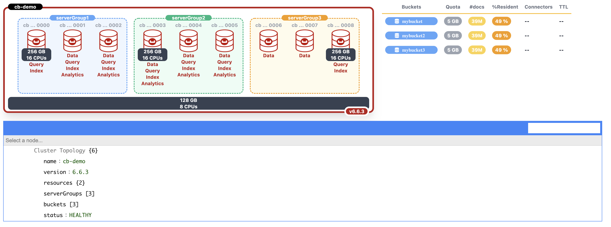
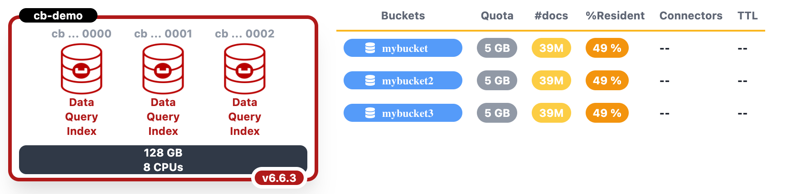
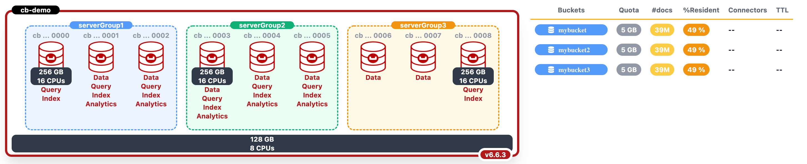

# JavaScript Couchbase Topology UI Viewer using Tailwind CSS
Couchbase Topology UI Viewer is a JavaScript Library to display Couchbase Cluster Topology, Services and Buckets details in your preferrable html browser: 



## Get Started 

### Dependencies

**Tailwind CSS** helps you to rapidly build modern websites without ever leaving your HTML. A utility-first CSS framework packed with classes like flex, pt-4, text-center and rotate-90 that can be composed to build any design, directly in your markup.


```
<!DOCTYPE html>
<html lang="en">
<head>
    ...
    <link href="https://unpkg.com/tailwindcss@^2/dist/tailwind.min.css" rel="stylesheet">
    ...
</head>
```

**[Optional]JsonEditor** is a web-based tool to view, edit, format, and validate JSON. It has various modes such as a tree editor, a code editor, and a plain text editor.

The editor can be used as a component in your own web application. The library can be loaded as CommonJS module, AMD module, or as a regular javascript file.

* [https://github.com/josdejong/jsoneditor](https://github.com/josdejong/jsoneditor)


### Topology Viewer

```
<head>
    <meta charset="UTF-8">
    <title>Couchbase Info CSS</title>
    <link href="https://unpkg.com/tailwindcss@^2/dist/tailwind.min.css" rel="stylesheet">
    <link href="https://cdnjs.cloudflare.com/ajax/libs/font-awesome/5.11.2/css/all.min.css" rel="stylesheet">
    <script src="js/couchbase-info.js"></script>
    <link href="css/jsoneditor.min.css" rel="stylesheet" type="text/css">
    <script src="js/jsoneditor.min.js"></script>
</head>
<body>
<div class="container">
    <main class="container-fluid">
        <div class="row justify-content-center">
            <div id="display" class="flex justify-content-center">
                <!-- cluster topology display would be here -->
            </div>
        </div>
        <div class="row justify-content-center">
            <form>
                <div id="jsoneditor" class="mx-5 w-90"></div>
            </form>
        </div>
    </main>
</div>
<script>
    var data =
        {
				... topology data here ...
        }
    let content = document.getElementById("display");
    create_cluster(content, data);
</script>
</body>
```


## Topologies Samples:


* **3 Nodes with Data, Query and Index Services with homogenous cpu/memory resources**:



```
    let data = {
        name: "cb-demo",
            version: "6.6.3",
        resources: {
        memory: "128",
            cpus: "8"
    },
        serverGroups: [
            {
                name: "serverGroup1",
                nodes: [
                    {
                        name: "cb-demo0000",
                        services: [
                            "Data",
                            "Query",
                            "Index"
                        ],
                        status: "HEALTHY"
                    },
                    {
                        name: "cb-demo0001",
                        services: [
                            "Data",
                            "Query",
                            "Index"
                        ],
                        status: "HEALTHY"
                    },
                    {
                        name: "cb-demo0002",
                        services: [
                            "Data",
                            "Query",
                            "Index"
                        ],
                        status: "HEALTHY"
                    }
                ],
                status: "HEALTHY"
            }
        ],
            buckets: [{ name: "mybucket", quota: 5590, documents: 39000000, ratio: 49, connectors: ["mobile","kafka", "elastic"]},
        { name: "mybucket2", quota: 5590, documents: 39000000, ratio: 49, connectors: ["mobile","kafka", "elastic"]},
        { name: "mybucket3", quota: 5590, documents: 39000000, ratio: 49, connectors: ["mobile","kafka", "elastic"]}],
        status: "HEALTHY"
    }
```


* **9 Nodes distributed accross 3 Server Group And non homogenous cpu/memory resources**: 




```
let data = {
            name: "cb-demo",
            version: "6.6.3",
            resources: {
                memory: "128",
                cpus: "8"
            },
            serverGroups: [
                {
                    name: "serverGroup1",
                    nodes: [
                        {
                            name: "cb-demo0000",
                            resources: {
                                memory: "256",
                                cpus: "16"
                            },
                            services: [
                                "Query",
                                "Index"
                            ],
                            status: "HEALTHY"
                        },
                        {
                            name: "cb-demo0001",
                            services: [
                                "Data",
                                "Query",
                                "Index",
                                "Analytics"
                            ],
                            status: "HEALTHY"
                        },
                        {
                            name: "cb-demo0002",
                            services: [
                                "Data",
                                "Query",
                                "Index",
                                "Analytics"
                            ],
                            status: "HEALTHY"
                        }
                    ],
                    status: "HEALTHY"
                },
                {
                    name: "serverGroup2",
                    nodes: [
                        {
                            name: "cb-demo0003",
                            resources: {
                                memory: "256",
                                cpus: "16"
                            },
                            services: [
                                "Data",
                                "Query",
                                "Index",
                                "Analytics"
                            ],
                            status: "HEALTHY"
                        },
                        {
                            name: "cb-demo0004",
                            services: [
                                "Data",
                                "Query",
                                "Index",
                                "Analytics"
                            ],
                            status: "HEALTHY"
                        },
                        {
                            name: "cb-demo0005",
                            services: [
                                "Data",
                                "Query",
                                "Index",
                                "Analytics"
                            ],
                            status: "HEALTHY"
                        }
                    ],
                    status: "HEALTHY"
                },
                {
                    name: "serverGroup3",
                    nodes: [
                        {
                            name: "cb-demo0006",
                            services: [
                                "Data"
                            ],
                            status: "HEALTHY"
                        },
                        {
                            name: "cb-demo0007",
                            services: [
                                "Data",
                            ],
                            status: "HEALTHY"
                        },
                        {
                            name: "cb-demo0008",
                            services: [
                                "Query",
                                "Index"
                            ],
                            resources: {
                                memory: "256",
                                cpus: "16"
                            },
                            status: "HEALTHY"
                        }
                    ],
                    status: "HEALTHY"
                }
            ],
            buckets: [{ name: "mybucket", quota: 5590, documents: 39000000, ratio: 49, connectors: ["mobile","kafka", "elastic"]},
                { name: "mybucket2", quota: 5590, documents: 39000000, ratio: 49, connectors: ["mobile","kafka", "elastic"]},
                { name: "mybucket3", quota: 5590, documents: 39000000, ratio: 49, connectors: ["mobile","kafka", "elastic"]}],
            status: "HEALTHY"
        };
    let content = document.getElementById("display");
    create_cluster(content, data);
```
