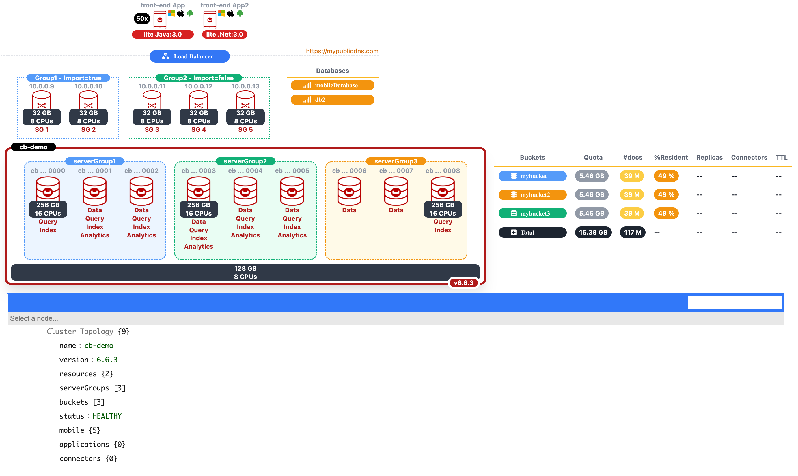
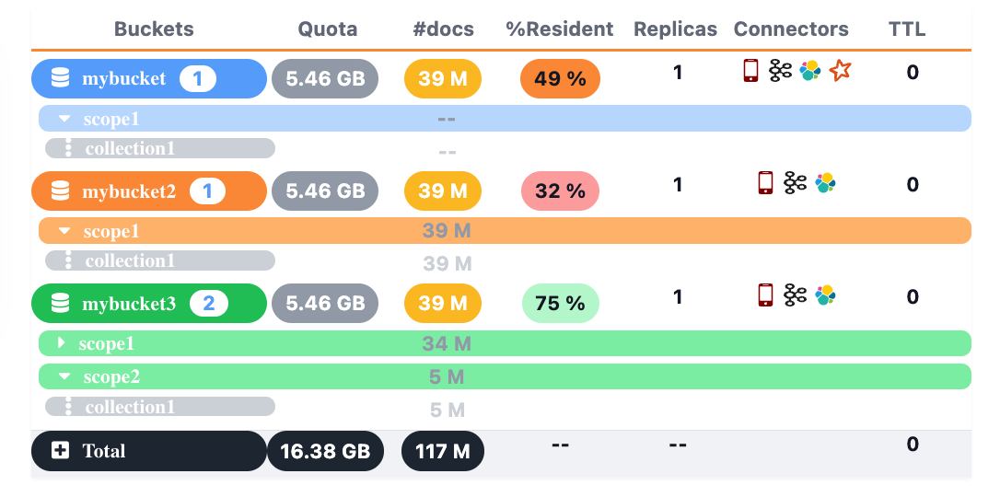

# JavaScript Couchbase Topology UI Viewer using Tailwind CSS
Couchbase Topology UI Viewer is a JavaScript Library to display Couchbase Cluster Topology, Services and Buckets details in your preferrable html browser: 



## Get Started 

### Dependencies

```
<!DOCTYPE html>
<html lang="en">
<head>
    <meta charset="UTF-8">
    <title>Couchbase Info CSS</title>
    <!-- font-awesome v5.15.4 -->
    <link href="https://cdnjs.cloudflare.com/ajax/libs/font-awesome/5.15.4/css/all.min.css" rel="stylesheet"/>
    <!-- tailwind v3.0.23 -->
    <script src="https://cdn.tailwindcss.com"></script>
    <!-- jsoneditor v9.7.3 -->
    <link href="https://cdnjs.cloudflare.com/ajax/libs/jsoneditor/9.7.3/jsoneditor.min.css" rel="stylesheet" type="text/css">
    <script src="https://cdnjs.cloudflare.com/ajax/libs/jsoneditor/9.7.3/jsoneditor.min.js"></script>
    <!-- topology-ui -->
    <script src="js/couchbase-info.js"></script>
</head>
```

| Library | Required | Description |
| :--- | :--- | :--- |
| [**Tailwind CSS**](https://tailwindcss.com/blog/tailwindcss-v3) | YES | helps you to rapidly build modern websites without ever leaving your HTML. A utility-first CSS framework packed with classes like flex, pt-4, text-center and rotate-90 that can be composed to build any design, directly in your markup.| 
| [**Font-Awesome**](https://fontawesome.com) | NO* | The easiest way to get icons on your website is with a Kit. It's your very own custom version of Font Awesome, all bundled up with only the icons, tools, and settings you need. |
| [**JsonEditor**](https://github.com/josdejong/jsoneditor) | NO | is a web-based tool to view, edit, format, and validate JSON. It has various modes such as a tree editor, a code editor, and a plain text editor. The editor can be used as a component in your own web application. The library can be loaded as CommonJS module, AMD module, or as a regular javascript file.|

(*): **Font-Awesome** library is not required but used by some components. If it is not loaded, the icon would be missing.

### Topology Viewer

```
<head>
    <meta charset="UTF-8">
    <title>Couchbase Info CSS</title>
    <link href="https://unpkg.com/tailwindcss@^2/dist/tailwind.min.css" rel="stylesheet">
    <link href="https://cdnjs.cloudflare.com/ajax/libs/font-awesome/5.11.2/css/all.min.css" rel="stylesheet">
    <script src="js/couchbase-info.js"></script>
    ...
</head>
<body>
<div class="container">
    <main class="container-fluid">
        <div class="row justify-content-center">
            <div id="display" class="flex justify-content-center">
                <!-- cluster topology display would be here -->
            </div>
        </div>
          ....
    </main>
</div>
<script>
    var data =
        {
				... topology data here ...
        }
    let content = document.getElementById("display");
    create_cluster(content, data);
</script>
</body>
```

## Data Structure

```
let data = {
            name: "cb-demo",
            version: "6.6.3",
            resources: {
                memory: "128",
                cpus: "8"
            },
            serverGroups: [
                {
                    name: "serverGroup1",
                    nodes: [
                        {
                            name: "cb-demo0000",
                            resources: {
                                memory: "256",
                                cpus: "16"
                            },
                            services: [
                                "Query",
                                "Index"
                            ],
                            status: "HEALTHY"
                        },
                        {
                            name: "cb-demo0001",
                            services: [
                                "Data",
                                "Query",
                                "Index",
                                "Analytics"
                            ],
                            status: "HEALTHY"
                        },
                        {
                            name: "cb-demo0002",
                            services: [
                                "Data",
                                "Query",
                                "Index",
                                "Analytics"
                            ],
                            status: "HEALTHY"
                        }
                    ],
                    status: "HEALTHY"
                },
                {
                    name: "serverGroup2",
                    nodes: [
                        {
                            name: "cb-demo0003",
                            resources: {
                                memory: "256",
                                cpus: "16"
                            },
                            services: [
                                "Data",
                                "Query",
                                "Index",
                                "Analytics"
                            ],
                            status: "HEALTHY"
                        },
                        {
                            name: "cb-demo0004",
                            services: [
                                "Data",
                                "Query",
                                "Index",
                                "Analytics"
                            ],
                            status: "HEALTHY"
                        },
                        {
                            name: "cb-demo0005",
                            services: [
                                "Data",
                                "Query",
                                "Index",
                                "Analytics"
                            ],
                            status: "HEALTHY"
                        }
                    ],
                    status: "HEALTHY"
                },
                {
                    name: "serverGroup3",
                    nodes: [
                        {
                            name: "cb-demo0006",
                            services: [
                                "Data"
                            ],
                            status: "HEALTHY"
                        },
                        {
                            name: "cb-demo0007",
                            services: [
                                "Data",
                            ],
                            status: "HEALTHY"
                        },
                        {
                            name: "cb-demo0008",
                            services: [
                                "Query",
                                "Index"
                            ],
                            resources: {
                                memory: "256",
                                cpus: "16"
                            },
                            status: "HEALTHY"
                        }
                    ],
                    status: "HEALTHY"
                }
            ],
            buckets: [
                { name: "mybucket", type: "couchbase", quota: 5590, documents: 39000000, replicas:1, ratio: 49, 
                   scopes: [{ name: "scope1", 
                              collections:[{name: "collection1"} ]}], 
                   connectors: ["mobile","kafka", "elastic", "spark"]
                }
                { name: "mybucket2", type: "ephemeral", quota: 5590, documents: 39000000, ratio: 32, replicas:1
                   scopes: [{ name: "scope1", documents: 39000000, 
                         collections:[{name: "collection1", documents: 39000000}]}], 
                         connectors: ["mobile","kafka", "elastic"]
                },
                { name: "mybucket3", type: "magma", quota: 5590, replicas:1, documents: 39000000, ratio: 75, 
                  scopes: [{ name: "scope1", documents: 34000000},
                           { name: "scope2", documents: 5000000, 
                                collections:[{name: "collection1", documents: 5000000}]}
                          ],
                  connectors: ["mobile","kafka", "elastic"]}
              ],
            status: "HEALTHY",
            mobile: {
	        version: "2.8.3",
                resources: {
                    memory: 32,
                    cpus: 8
                },
                groups : [{
                    name:"Group1 - Import=true",
                    instances: [
                        {
                            nodeIp: "10.0.0.9",
                            name: "SG 1",
                            resources: {
                                memory: 32,
                                cpus: 8
                            }
                        },
                        {
                            nodeIp: "10.0.0.10",
                            name: "SG 2",
                            resources: {
                                memory: 32,
                                cpus: 8
                            }
                        }]
                },
                    {
                        name:"Group2 - Import=false",
                        instances: [
                            {
                                nodeIp: "10.0.0.11",
                                name: "SG 3",
                                resources: {
                                    memory: 32,
                                    cpus: 8
                                }
                            },
                            {
                                nodeIp: "10.0.0.12",
                                name: "SG 4",
                                resources: {
                                    memory: 32,
                                    cpus: 8
                                }
                            },
                            {
                                nodeIp: "10.0.0.13",
                                name: "SG 5",
                                resources: {
                                    memory: 32,
                                    cpus: 8
                                }
                            }]
                    }],
                databases: [{name: "mobileDatabase" },{name: "db2" }],
                publicAddress: "https://mypublicdns.com",
                clients: [{ name:"front-end App", versions: ["3.0"], os:["windows","ios","android"], language: "Java", total:50},{ name:"front-end App2", versions: ["3.0"], os:["windows","ios","android"], language: ".Net"}]
            },
            applications: {},
            connectors: {}
        };
```

### Data Structure Properties

* **name**: display name of the cluster 
* **version**: cluster version
* **resources**: If all/majority of nodes have the same hardware (cpu/memory) you can fill the resources at the cluster level instead of individual nodes.  

```
{
  memory: "128",
  cpus: "8"
}
            
```
            
* **serverGroups**: Array of Server Groups. Each Server Group contains the information of the Server Group name, list of nodes and status. 

```
[
{
                    name: "serverGroup1",
                    nodes: [
                        {
                            name: "cb-demo0000",
                            resources: {
                                memory: "256",
                                cpus: "16"
                            },
                            services: [
                                "Query",
                                "Index"
                            ],
                            status: "HEALTHY"
                        },
                        ...
                    ],
                    status: "HEALTHY"
                },
                {
                    name: "serverGroup2",
                    ...
                } 
            ]
```

* **buckets**: Array of Buckets. You can define `ephemeral`, `couchbase` and `magma` bucket types. The default value if `type` property is missing is `couchbase`. Optionally, you can display the list of scopes and collections per scope. Another optional property among others, is `connectors` that would accept the following enum values: `mobile`, `kafka`, `elastic`, `spark`



```   
             buckets: [
                { name: "mybucket", type: "couchbase", quota: 5590, documents: 39000000, replicas:1, ratio: 49, 
                   scopes: [{ name: "scope1", 
                              collections:[{name: "collection1"} ]}], 
                   connectors: ["mobile","kafka", "elastic", "spark"]
                }
                { name: "mybucket2", type: "ephemeral", quota: 5590, documents: 39000000, ratio: 32, replicas:1
                   scopes: [{ name: "scope1", documents: 39000000, 
                         collections:[{name: "collection1", documents: 39000000}]}], 
                         connectors: ["mobile","kafka", "elastic"]
                },
                { name: "mybucket3", type: "magma", quota: 5590, replicas:1, documents: 39000000, ratio: 75, 
                  scopes: [{ name: "scope1", documents: 34000000},
                           { name: "scope2", documents: 5000000, 
                                collections:[{name: "collection1", documents: 5000000}]}
                          ],
                  connectors: ["mobile","kafka", "elastic"]}
              ]
```

*Note: Information at the bucket/scope/collections level is optional.* 

* **status**: Status of the cluster. 

* **mobile**: Sync Gateway and Couchbase Lite topology information

```
 mobile: {
             version: "2.8.3",
                groups : [{
                    name:"Group1 - Import=true",
                    instances: [
                        {
                            nodeIp: "10.0.0.9",
                            name: "SG 1",
                            resources: {
                                memory: 32,
                                cpus: 8
                            }
                        },
                        ...]
                   },
                   {
                        name:"Group2 - Import=false",
                        instances: [
                            {
                                nodeIp: "10.0.0.11",
                                name: "SG 3"
                            },
                            ... ]
                   }],
                databases: [{name: "mobileDatabase" },
                            {name: "db2" }],
                publicAddress: "https://mypublicdns.com",
                clients: [{ name:"front-end App", versions: ["3.0"], os:["windows","ios","android"], language: "Java", total:50}, 
                          { name:"front-end App2", versions: ["3.0"], os:["windows","ios","android"], language: ".Net"}]
            }
```

* **Applications**: TBD

* **Connectors**: TBD


## Topologies Samples:

* [**3 Nodes with Data, Query and Index Services with homogenous cpu/memory resources**](docs/samples/server-3nodes.md)

* [**3 Data Nodes, 2 Query/Index Nodes**](docs/samples/server-5nodes.md)

* [**3 Data Nodes, 2 Query/Index Nodes, 2 FTS/Eventing Nodes**](docs/samples/server-7nodes.md)

* [**9 Nodes distributed accross 3 Server Group And non homogenous cpu/memory resources**](docs/samples/server-9nodes.md)

* [**mobile** - 2 Sync Gateways and 3 data,query,index nodes](docs/samples/mobile-2sg-3nodes.md)

* [**mobile** - 2 Sync Gateway Groups, 3 data and 2 query/index nodes](docs/samples/mobile-5sg-5nodes.md)

* [**mobile** - 2 Clients Couchbase Lite languages, 2 groups of 5 Sync Gateways and 3 server groups](docs/samples/mobile-5sg-9nodes.md)
